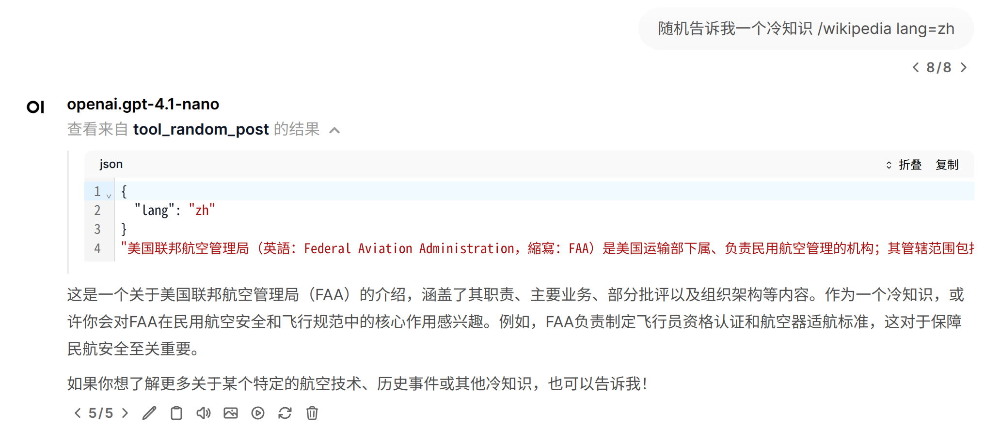

# mcp-wikipedia



让大模型能够搜索维基百科相关内容。实现了如下功能：

- 概念搜索：返回匹配度最高的5个主题，同时提供对应的摘要
- 页面摘要：获取指定主题的摘要
- 全文获取：加载指定主题的完整内容
- 随机探索：获取随机页面内容

每个功能都可以指定语言，默认是 `lang=en`。

参数说明在代码注释里，应该不需要额外的提示词就能让模型调用接口。你也可以告诉它 `搜索中文维基`，或者偷个懒，写上 `wikipedia zh` 的关键词就好了。

# Usage

首先，下载本仓库：

```
cd <path of MCP servers>
git clone https://github.com/ShwStone/mcp-wikipedia.git
```

然后打开你的 MCP 配置文件（mcpo 或 claude）：

```json
{
  "mcpServers": {
    "wikipedia": {
      "command": "uv",
      "args": [
        "--directory",
        "<path of MCP servers>/mcp-wikipedia",
        "run",
        "python",
        "main.py"
      ]
    }
  }
}
```
